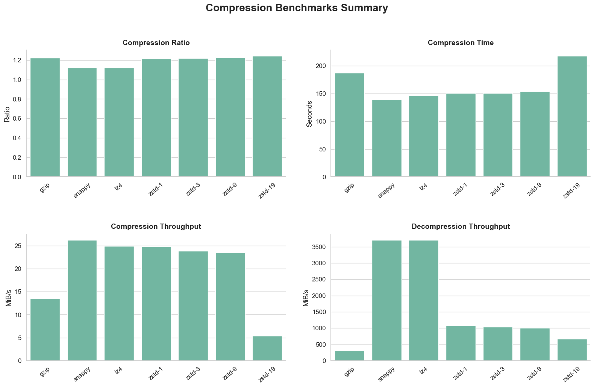

+++
title = "Which Compression Saves the Most Storage $? (gzip, Snappy, LZ4, zstd)"
date = "2025-08-18T22:04:52+03:00"
description = "A detailed comparison of gzip, Snappy, LZ4, and zstd compression algorithms, analyzing their impact on storage savings, performance, and cost based on real-world data benchmarks."
tags = ["compression", "benchmarking", "data-engineering"]
categories = ["tech"]
draft = false
+++

Compression setting are set and forget in most cases, if it works no reason to change it. I decided to look into and see whether it would be beneficial to review the defaults and if it could save money. I covered most of the algorithms discussed in this post previously in [Compression Algorithms You Probably Inherited](https://mamonas.dev/posts/compression-algorithms-you-probably-inherited/), where I summarized the info I collected while researching. But I wanted to sanity-check the findings myself and decided to run some benchmarks. This should help me see if compression actually makes a difference for storage costs.

---

## What I Tested

To keep things real, I used actual data: [NYC TLC trip records](https://www.nyc.gov/site/tlc/about/tlc-trip-record-data.page). Each month’s data file was ~500MB. I combined a few to get files at 500MB, 1.6GB, 3.9GB, and 6.6GB.

**Compression algorithms tested:**
- gzip
- Snappy
- LZ4
- zstd at levels 1, 3, 9, and 19

**Environment:**
- MacBook Pro (2021, M1 Pro, 16GB RAM)
- Single-threaded runs

I couldn’t process the largest file with my setup. SKILL ISSUE. In reality, I didn’t bother trying to fix it, multi-threading and batching the compression should have allowed me to do it, but I already had the 3 other files to work with.

To run the benchmarks, I built a small CLI tool: [compressbench](https://github.com/KonMam/compressbench). It’s publicly available and it currently supports gzip, snappy, lz4, and zstd (with levels) and outputs compression/decompression benchmarks for Parquet files. I’m planning to add support for custom codecs later, mostly so I can benchmark my own RLE, Huffman, and LZ77 implementations.

---

## Results

### Compression Ratio

If you only care about the smallest file, zstd-19 and gzip come out ahead. But the margin over zstd-3 is tiny, and you pay for it heavily elsewhere. Snappy and LZ4 compress to about 1.12 - just enough to make it look like they tried. But if that’s all you have, 12% savings is still better than no savings.

For most storage use cases, zstd-3 gets close enough to the “best” ratio without turning your CPU into a space heater.

### Compression Speed

Snappy and LZ4 are fast. zstd-1, 3, and 9 kept up surprisingly well. gzip is predictably slow. zstd-19 made me question my life choices, I thought it might have frozen or got silently murdered by the OS. I’m not saying never use it, there are some use cases, but they’re likely few and far between.

### Decompression Speed

Snappy and LZ4 hit over 3.5GB/s. zstd held steady around 1GB/s across all levels. gzip stayed slow.

If you need to read the same data multiple times Snappy and LZ4 are faster than gzip or zstd. But zstd isn’t slow enough to matter unless your volumes are huge.

---

### File Size Scaling

Throughput went down as file size grew. Gzip was slow the whole time. zstd-19 was even slower and I didn't run it for all file size, so it may have gone even more down.

The others held up fairly well. Snappy stayed fastest, but none of them completely fell apart.

Note: CPU was pinned at 100% during all runs. On a single-threaded, 16GB machine, there was probably some memory pressure too for the larger files. These results match what I’ve seen elsewhere but might be a bit exaggerated.

---

### Storage Cost (S3)

S3 Standard pricing in eu-central-1 is $0.0235/GB. At 500TB/month, codec choice can have a significant (based on your budged) impact on the cost. But if you're only storing a few TB, this doesn’t matter much. At 100TB, you're looking at maybe a few hundred bucks.

Snappy/LZ4 would cost around $10.7K/month. zstd-3 lands near $9.7K for 500TBs. zstd-19 saves a bit more, but the compute cost and latency make it hard to justify. gzip is in the same ballpark, and we’ve already covered its performance.

---

## What to Pick?

**For streaming**
Snappy or LZ4. Fast compression and decompression. Compression ratio better than nothing.

**For batch ETL or periodic jobs**
zstd-1 or zstd-3. Good balance between speed and size.

**For archival**
zstd-9 if you care for small gains. zstd-19 if you’re archiving something you hope nobody ever reads again.

---

## Final Thoughts

After my initial post, I assumed the real-life impact of LZ4 and zstd would be more obvious. But it turns out you need quite a bit of scale to feel it. In the future, I won’t be so quick to dismiss Snappy as it has its place. But it’s not the only viable option there is.

I'd also like to benchmark compute cost in the future and see whether using zstd at scale is actually worth it for batch processes or if the additional compute time eats up your storage savings.

Also keep in mind that your mileage might vary based on your data, compression is about finding patters and if there's none, the result might be a larger file than you began with, so pick accordingly, maybe run a benchmark yourself.

---

Thank you for reading.
